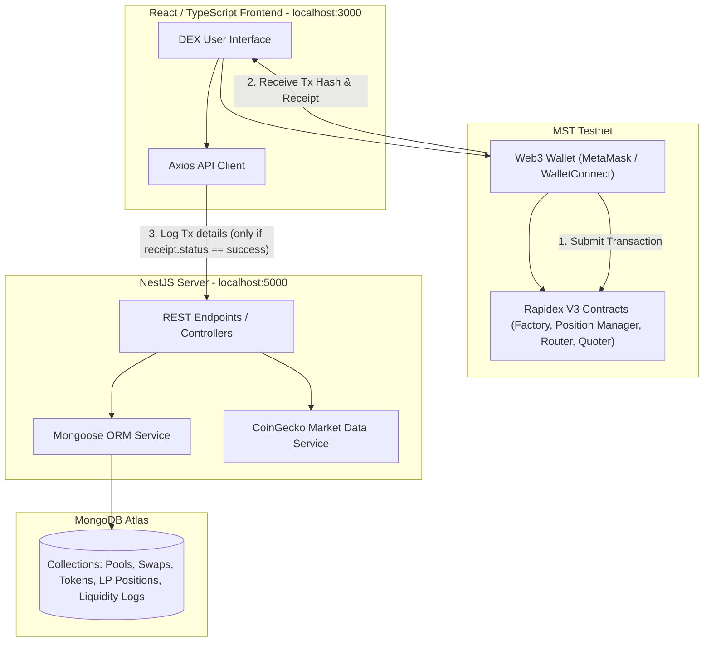

# Rapidex — MST Testnet DEX

A Uniswap V3–based decentralized exchange for the MST Testnet, consisting of three parts in this repo:

- **`src/`** — React + Vite + TypeScript frontend (swap, explore, liquidity pools, portfolio)
- **`dex-backend/`** — NestJS + MongoDB backend (indexes pools/swaps/liquidity, serves chart data & market data)
- **`contracts/`** — Foundry project with the Rapidex V3 factory/periphery contracts (built on Uniswap V3 core/periphery) and WMST/test-USDC tokens

---

## Architecture



---

## Current deployed contracts (MST Testnet, chainId `91562037`)

RPC: `https://testnetrpc.mstblockchain.com`

| Contract | Address |
| :--- | :--- |
| WMST | `0xB93ad291BD259Ed8d5f8efe93aA6811f901A967D` |
| USDC (test token) | `0xa6189DAeB88A24c83192952AC9edAf383BA62D25` |
| V3 Factory | `0x31459928076f879e5a7934FeE90D00952fA53Ba5` |
| NonfungiblePositionManager | `0xB5eC969004FFBD7b959d8C8Aefd8633C90451e9a` |
| SwapRouter | `0xBC20dA0112a045aDaBfd08b26622900c706E1E97` |
| QuoterV2 | `0x9e20b0D82f69B8406bd32adF9863Ef3A8d41283c` |

These live in `src/config/addresses.json` (frontend) and `contracts/.env` (Foundry scripts) — **update both** if you redeploy.

The **NonfungiblePositionManager** is the single entry point for creating pools and minting liquidity positions:
- `createAndInitializePoolIfNecessary(token0, token1, fee, sqrtPriceX96)` — creates + initializes a pool (idempotent)
- `mint(params)` — mints an LP position (ERC-721 NFT)

The **Factory** is only used for pool discovery/lookup (`getPool(tokenA, tokenB, fee)`), not called directly by end users.

> Uniswap V3 requires `token0 < token1` by address value (not by price/value) — this determines which of WMST/USDC is token0 for a given deployment and flips depending on the addresses generated.

---

## Prerequisites

- Node.js v18+
- [Foundry](https://book.getfoundry.sh/) (`forge`, `cast`) for contract work
- A MongoDB instance (local or Atlas) for the backend

---

## 1. Frontend setup

```bash
npm install
npm run dev        # starts Vite dev server on http://localhost:3000
npm run build       # production build (tsc + vite build)
npm run test        # vitest
```

`.env` (repo root):

```env
VITE_WMST_ADDRESS=0xB93ad291BD259Ed8d5f8efe93aA6811f901A967D
VITE_SWAP_ROUTER_ADDRESS=0xBC20dA0112a045aDaBfd08b26622900c706E1E97
VITE_QUOTER_V2_ADDRESS=0x9e20b0D82f69B8406bd32adF9863Ef3A8d41283c
VITE_USDC_ADDRESS=0xa6189DAeB88A24c83192952AC9edAf383BA62D25
VITE_USDC_DECIMALS=18
VITE_V3_FACTORY_ADDRESS=0x31459928076f879e5a7934FeE90D00952fA53Ba5
VITE_POSITION_MANAGER_ADDRESS=0xB5eC969004FFBD7b959d8C8Aefd8633C90451e9a
VITE_API_URL=http://localhost:5000
VITE_SUBGRAPH_URL=http://localhost:8000/subgraphs/name/mst/rapidex
```

Vite only reads `.env` at startup — restart the dev server after editing it.

---

## 2. Backend setup

```bash
cd dex-backend
npm install
npm run start:dev   # NestJS in watch mode on http://localhost:5000
npm run test
npm run test:integration
npm run test:e2e
```

`dex-backend/.env`:

```env
PORT=5000
MONGO_URI=mongodb://<user>:<pass>@<cluster-hosts>/?ssl=true&replicaSet=<name>&authSource=admin&appName=<name>
```

Swagger/OpenAPI docs: `http://localhost:5000/api`. CORS is enabled globally.

### Database collections

| Collection | Purpose |
| :--- | :--- |
| `pools` | Registered liquidity pools (addresses, reserves, fee tier) |
| `swaps` | Swap transaction log |
| `tokens` | Tokens registered via pool creation |
| `addliquidities` / `removeliquidities` | Liquidity deposit/withdrawal log |
| `lppositions` | LP position NFT state (tokenId, ticks, liquidity, amounts) |
| `onchainpooldata` | Raw on-chain pool-creation event data |
| `indexerstates` / `listener_state` | Event-indexer bookkeeping |

**Important:** these collections currently accumulate records from every contract deployment ever tested against (same chainId, different contract addresses). If you redeploy contracts (see below), old pool/token/swap records referencing dead addresses are **not automatically cleaned up** — either add filtering by current factory/token address in the services, or manually purge stale documents.

### Key API endpoints

| Module | Method | Endpoint | Description |
| :--- | :--- | :--- | :--- |
| Pools | `POST` / `GET` | `/pools`, `/pools/:address` | Register / list / fetch a pool |
| Swaps | `POST` / `GET` | `/swaps`, `/swaps/wallet/:address` | Record / list swaps |
| Tokens | `GET` | `/tokens`, `/tokens/:address` | List / fetch registered tokens |
| Chart Data | `GET` | `/chart-data/candles?poolAddress=...&timeframe=...` | OHLC candles (`1m`–`1d`) |
| Market Data | `GET` | `/market-data`, `/market-data/:tokenAddress` | CoinGecko-backed price/stats |
| Add/Remove Liquidity | `POST` / `GET` | `/add-liquidity`, `/remove-liquidity` | Log liquidity changes, auto-updates pool reserves |
| Activity | `GET` | `/activity/:poolAddress` | Unified swap + liquidity activity feed |

**Integration rule:** only call these logging endpoints *after* confirming `receipt.status === "success"` on-chain. A reverted transaction must never be posted as if it succeeded — this previously caused pool reserve data to drift from real on-chain balances.

---

## 3. Contracts setup (Foundry)

```bash
cd contracts
forge build
forge test -vvv
```

`contracts/.env`:

```env
RPC_URL=https://testnetrpc.mstblockchain.com
WS_RPC_URL=wss://testnetrpc.mstblockchain.com
PRIVATE_KEY=<deployer_private_key>
WMST_ADDRESS=0xB93ad291BD259Ed8d5f8efe93aA6811f901A967D
CHAIN_ID=91562037
V3_FACTORY_ADDRESS=0x31459928076f879e5a7934FeE90D00952fA53Ba5
POSITION_MANAGER_ADDRESS=0xB5eC969004FFBD7b959d8C8Aefd8633C90451e9a
SWAP_ROUTER_ADDRESS=0xBC20dA0112a045aDaBfd08b26622900c706E1E97
QUOTER_V2_ADDRESS=0x9e20b0D82f69B8406bd32adF9863Ef3A8d41283c
USDC_ADDRESS=0xa6189DAeB88A24c83192952AC9edAf383BA62D25
LP_STATE_STORAGE_ADDRESS=0x0000000000000000000000000000000000000000
DEPLOYER=<deployer_address>
```

### Source layout

- `contracts/src/*.sol` — thin wrapper contracts (`WMST.sol`, `TestToken.sol`, and `*Importer.sol` wrappers that inherit the real Uniswap V3 core/periphery contracts from `lib/`)
- `contracts/src/flattened/*.flat.sol` — fully self-contained, zero-import versions of every deployed contract (verified byte-identical to on-chain bytecode) — use these if you need the full source without pulling `lib/` dependencies
- `contracts/lib/` — vendored dependencies (`v3-core-main`, `v3-periphery-main`, `openzeppelin-contracts-master`, `forge-std-master`)
- `contracts/script/*.s.sol` — deploy scripts:
  - `DeployMST.s.sol` — deploys WMST only
  - `DeployV3Stack.s.sol` — deploys Factory + PositionManager + SwapRouter + QuoterV2 around an existing WMST (reads `WMST_ADDRESS` from env)
  - `DeployFullStack.s.sol` — full reset: deploys a new WMST, new test USDC, and the full V3 stack in one transaction batch
  - `DeployLPStateStorage.s.sol`, `DeploySwapDemo.s.sol` — auxiliary/demo scripts

### Redeploying

```bash
# Full reset (new WMST, new USDC, new factory/router/quoter/position manager):
forge script script/DeployFullStack.s.sol:DeployFullStack \
  --rpc-url https://testnetrpc.mstblockchain.com \
  --broadcast --legacy --gas-price 1000000000

# Factory + periphery only (reuse existing WMST/USDC):
forge script script/DeployV3Stack.s.sol:DeployV3Stack \
  --rpc-url https://testnetrpc.mstblockchain.com \
  --broadcast --legacy --gas-price 1000000000
```

> This chain rejects the default EIP-1559 gas estimation (`gas tip cap below minimum`) — use `--legacy --gas-price 1000000000` (1 gwei) as shown above.

After redeploying, update: `.env` (frontend), `contracts/.env`, `src/config/addresses.json` — and restart the Vite dev server.

### Cast lifecycle commands

Load env vars first:

```bash
# Git Bash
set -a; source contracts/.env; set +a
```

```bash
# Verify a pool exists for a given fee tier (500 = 0.05%, 3000 = 0.3%, 10000 = 1%)
cast call "$V3_FACTORY_ADDRESS" "getPool(address,address,uint24)(address)" \
  "$WMST_ADDRESS" "$USDC_ADDRESS" 3000 --rpc-url "$RPC_URL"

# Read a pool's current price/tick
cast call <POOL_ADDRESS> "slot0()(uint160,int24,uint16,uint16,uint16,uint8,bool)" --rpc-url "$RPC_URL"

# Check an LP position NFT owner
cast call "$POSITION_MANAGER_ADDRESS" "ownerOf(uint256)(address)" 1 --rpc-url "$RPC_URL"

# Check a wallet's token balance
cast call "$USDC_ADDRESS" "balanceOf(address)(uint256)" "$DEPLOYER" --rpc-url "$RPC_URL"

# Get a swap quote (no state change)
cast call "$QUOTER_V2_ADDRESS" \
  "quoteExactInputSingle((address,address,uint256,uint24,uint160))(uint256,uint160,uint32,uint256)" \
  "($WMST_ADDRESS,$USDC_ADDRESS,1000000000000000000,3000,0)" --rpc-url "$RPC_URL"
```

---

## Known gotchas / non-obvious behavior

- **token0/token1 ordering** is purely numeric address comparison, unrelated to price. It flips on every redeploy since new contracts get new addresses — the frontend code already handles this dynamically (`LiquidityPage.tsx`), don't hardcode an assumption either direction.
- **A pool, once initialized, cannot change its starting price** — `initialize()` can only be called once. If you initialize at the wrong price, you must create a new pool at a different, still-unused fee tier.
- **"Price slippage check" revert on mint** almost always means the tick range you're minting into doesn't contain (or isn't centered near) the pool's actual current tick — verify via `slot0()` before minting, especially for narrow "stable" ranges.
- **Fallback values exist** for when live data isn't available yet: WMST/USDC price falls back to `1.85`, pool APR falls back to `12.4%`. These only show up if the real on-chain/backend data fetch fails — don't mistake them for real numbers.
- **Backend never validates transaction receipts** before logging (fixed in `LiquidityPage.tsx` for the frontend's own calls: it now checks `receipt.status === "success"` before posting to `/pools`, `/add-liquidity`, etc.) — if you add new transaction flows, always check status before logging.
- **USDC here is a simple mintable test token** (`TestToken.sol`), not a real stablecoin — anyone can call `mint(to, amount)` on it.
